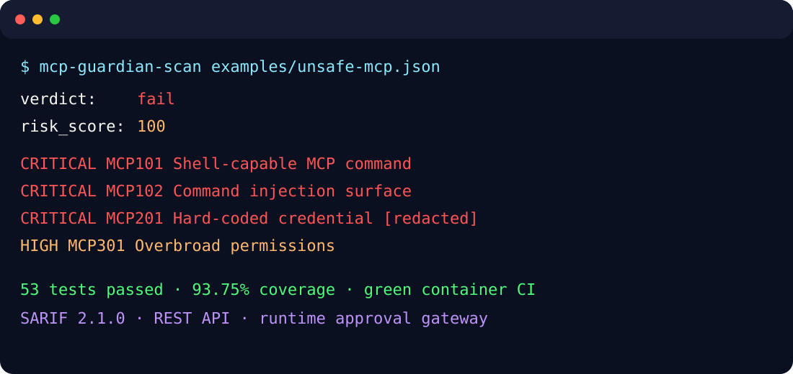
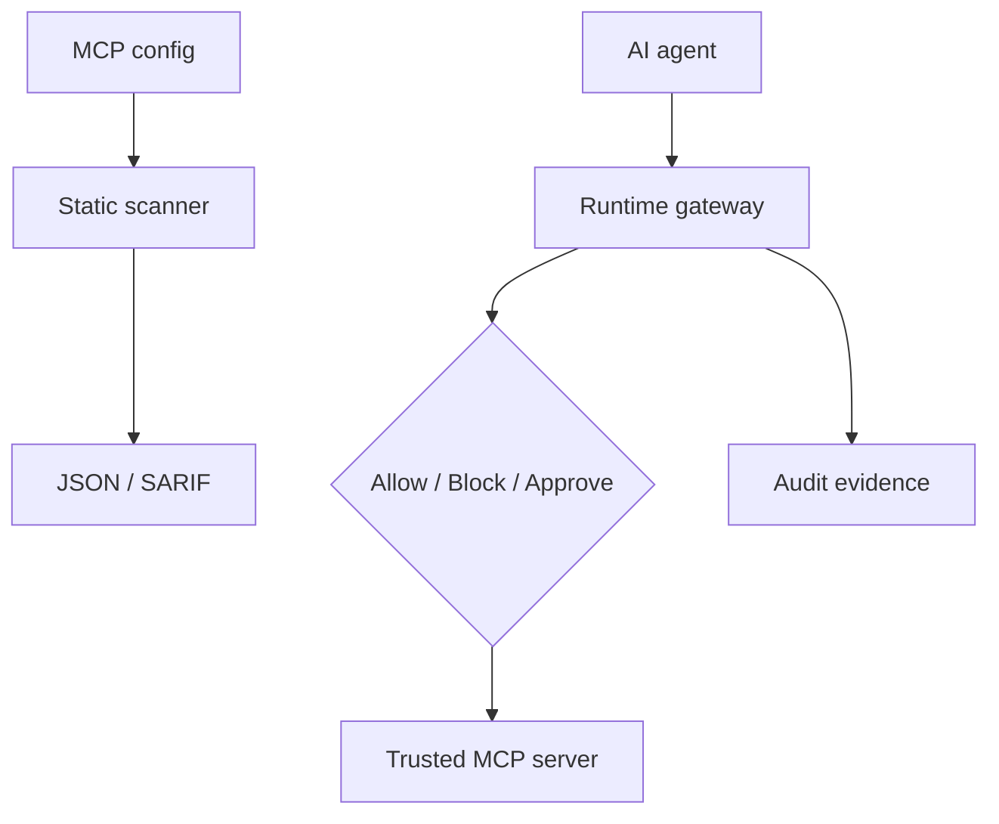

# MCP Guardian — Acquisition Showroom

**MCP security scanning before deployment. Deterministic governance at tool-call time.**

MCP Guardian is a private-source software component available through a non-exclusive organization source license or a separately negotiated project acquisition. It detects risky MCP configuration in CI, emits SARIF, and enforces allow/block/human-approval decisions when AI agents call tools.

## The gap

Agent observability explains what happened. Prompt guardrails inspect model traffic. Traditional SAST inspects source. MCP Guardian controls the boundary where agent configuration becomes executable tool access.

## Integration surface

- CLI: scan JSON/YAML and return CI exit codes
- SARIF 2.1.0: upload findings to existing code-scanning workflows
- REST: embed scanner decisions in a product backend
- Runtime proxy: enforce trusted upstreams and risk policy
- Approval API: route destructive or high-value actions to a human
- Audit API: retrieve tenant-scoped records and verify chain integrity

## Architecture

## Verified snapshot

| Metric | Verified result |
|---|---:|
| Tests | 53 passed |
| Statement coverage | 93.75% |
| Calibration / holdout cases | 10 / 30 synthetic fixtures |
| Calibration / holdout runs | 1,000 / 3,000 |
| Precision / recall on both corpora | 1.000 / 1.000 |
| Holdout median / p95 latency | 0.0144 ms / 0.0259 ms |
| Production + development audits | 0 known vulnerabilities |
| Container | Build, startup, health and authenticated scan verified in CI |

The accuracy result applies only to the included seller-authored synthetic corpora. The separate holdout is not third-party validation and the result is not presented as a universal real-world detection rate.

## What the buyer receives

Complete private source and repository history, tests, evaluation suite, API/CLI, Docker and CI assets, documentation, assignable seller-owned project IP, and ten business days of asynchronous transition support during the first 30 days after closing.

**Organization source license: EUR 1,990** — [buy on Payhip](https://payhip.com/b/kL8Z3). One legal organization receives the current source under a non-exclusive license; no exclusive IP or future support is included.\n\n**Project acquisition initial asking price: EUR 19,500**, subject to NDA, technical/legal diligence, existing non-exclusive licenses, and a signed asset purchase/IP assignment agreement.

No production implementation details are included in this showroom. A read-only private review can follow mutual NDA.

## Acquisition

Project acquisition is a separate software asset transaction, not a subscription, token sale, equity offering, or revenue-multiple claim. Licenses already granted remain subject to their terms. See [ACQUISITION.md](ACQUISITION.md), [BENCHMARKS.md](BENCHMARKS.md), [TECHNICAL_OVERVIEW.md](TECHNICAL_OVERVIEW.md), and [INTEGRATION.md](INTEGRATION.md).

To request the public-safe acquisition brief or NDA process, contact the owner through the [GitHub profile](https://github.com/Inkh95).
