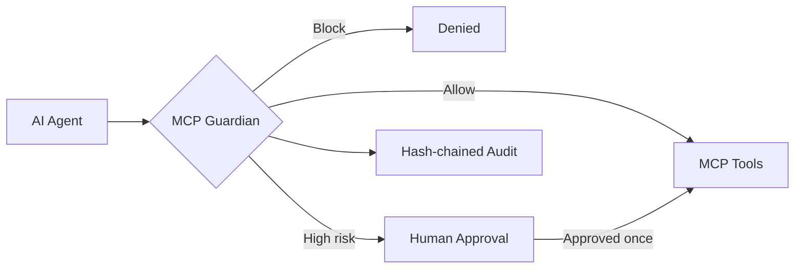

# MCP Guardian

### Runtime security, approval, and audit infrastructure for AI agents and MCP tools

[](#acquisition)
[](#verified-build)
[](#verified-build)
[](#verified-build)

MCP Guardian is a completed, privately held source-code and intellectual-property asset. It sits between AI agents and their MCP tools to evaluate every action before execution, block unsafe requests, require human approval for high-risk operations, and create a tamper-evident audit trail.

> **The production repository is private.** This repository is a non-code acquisition showroom. Source access is available only through controlled technical due diligence under NDA.

## The problem

AI agents can call tools that read private data, modify repositories, send messages, move money, or delete production resources. Native tool access does not by itself provide consistent policy enforcement, approval gates, tenant isolation, or defensible audit evidence.

MCP Guardian provides that control layer.



## What the private asset includes

| Capability | Production implementation |
|---|---|
| MCP interception | JSON-RPC enforcement proxy with trusted upstream routing |
| Deterministic policy engine | Allow, block, or require approval without an external model dependency |
| Threat controls | Destructive actions, prompt injection, secret exposure, exfiltration, transaction thresholds |
| Approval workflow | Persistent state with atomic execution claims and duplicate-execution prevention |
| Enterprise isolation | Tenant-scoped approvals, audit queries, and trusted tenant assignment |
| Authorization | Separate operator and approver credentials with constant-time comparison |
| Audit integrity | SHA-256 chained records and tamper verification endpoint |
| Signed events | HMAC-SHA256 webhook authentication and replay-window validation |
| Dashboard | Self-contained tenant security and decision console |
| Deployment | Docker, Compose, REST/OpenAPI, tests, benchmark, and technical documentation |

## Example decisions

```json
{
  "decision": "require_approval",
  "risk_score": 85,
  "reasons": ["Destructive tool call"],
  "matched_rules": ["destructive-action"]
}
```

```json
{
  "decision": "block",
  "risk_score": 95,
  "reasons": ["Sensitive credential material detected"],
  "matched_rules": ["secret-exposure"]
}
```

## Verified build

Private release **v0.5.0** has been verified with:

- 31/31 automated tests passing
- 92.66% measured code coverage
- 50,000-iteration deterministic policy benchmark
- 0.0215 ms p95 policy-evaluation latency on the reference environment
- Reproducible test and benchmark commands included in the private repository

Benchmark results are host-dependent and exclude HTTP transport and persistence overhead. Claims can be reproduced during supervised technical due diligence.

## Security disclosure model

The public materials intentionally exclude proprietary source, exact detection logic, internal schema details, deployable configuration, and buyer-only documentation. Qualified buyers can receive:

1. Supervised product demonstration
2. Mutual NDA
3. Read-only private due-diligence access
4. Reproducible tests and benchmark execution
5. Source/IP purchase agreement and repository transfer

## Acquisition

**Offering:** complete source code, repository history, assignable project IP, tests, deployment assets, documentation, and a defined technical transition period.

**Fixed asking price: €149,000**

This is a one-time asset acquisition. It is not a subscription offering, revenue-multiple claim, token sale, or public-source license.

To request the acquisition brief or NDA process, contact the owner privately through the [GitHub profile](https://github.com/inkh95).

## Notice

Copyright © 2026. All rights reserved. No production source code is distributed in this repository. Product names and third-party marks belong to their respective owners. Any transaction remains subject to identity verification, definitive agreements, and applicable law.

